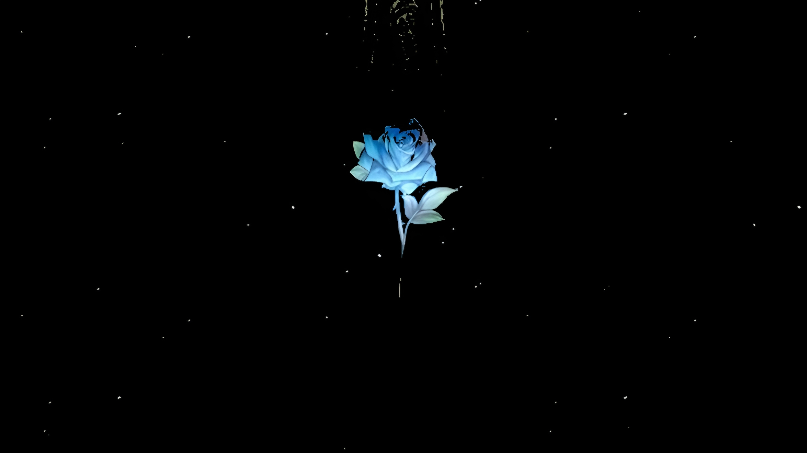
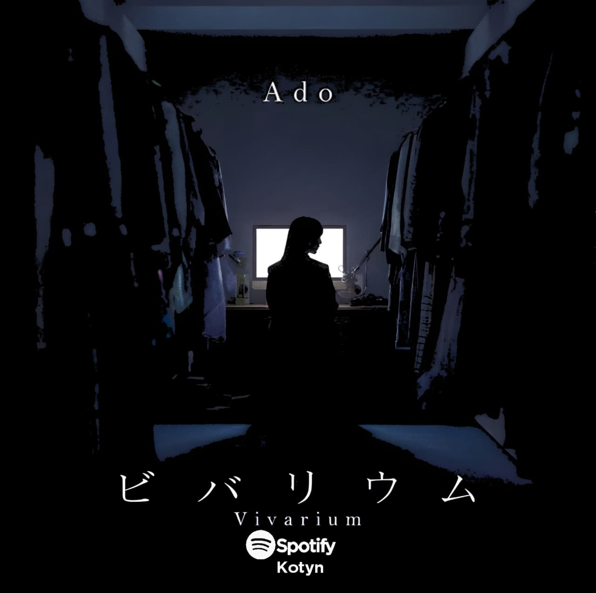
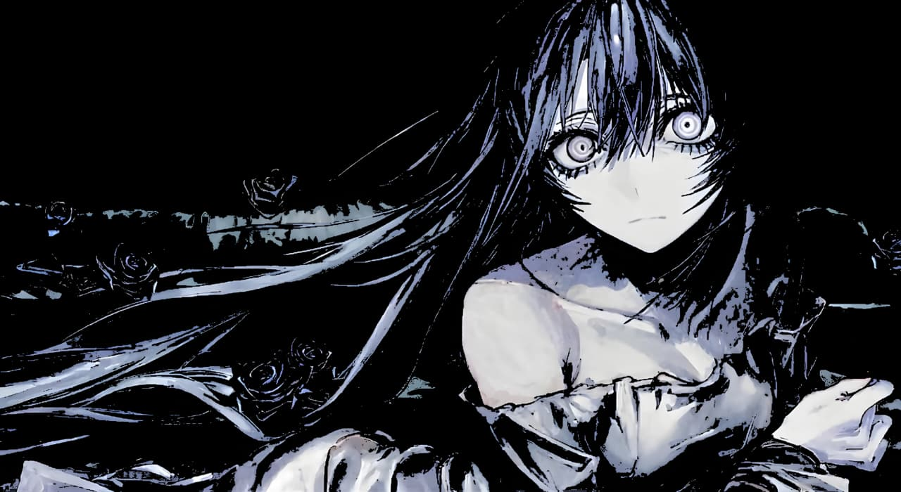

<p align="center">
  
</p>

<div align="center">
  
</div>

<p align="center">
  <sub><sup>S C U D E R I A &nbsp; D E V &nbsp; — &nbsp; L O N D R I N A &nbsp; / &nbsp; P R</sup></sub>
</p>

<div align="center">
  
</div>

<br>

<div align="center">


</div>

<h3 align="center"><sub> 𝐒 𝐎 𝐁 𝐑 𝐄 &nbsp; 𝐌 𝐈 𝐌</sub></h3>

<table align="center">
<tr>

<td width="60%">

<p align="left">

Sou um estudante de programação e designer gráfico, buscando evoluir constantemente e transformar conhecimento em prática.
Atualmente gosto de misturar programação com aquilo que me inspira — arte, estética e identidade. Atualmente estudo na Unicesumar - Londrina/PR e utilizo o VSCode como principal ferramenta.
Sigo evoluindo e aplicando conhecimento constantemente.
Seja bem-vindo ao meu GitHub.

</p>

</td>

<td width="40%" align="center">


</td>

</tr>
</table>

<div align="center">


</div>

<div align="center">
  
  
</div>

<div align="center">

<sub>
M A I S &nbsp; T O C A D A &nbsp; — &nbsp;  A D O 
</sub>

<br>


</div>

<table align="center" style="border: none;">
<tr style="border: none;">

<td width="60%" style="border: none;">

```
— FREQUÊNCIAS ———————————————————————————————————————————————   
  01   Vivarium                          Ado       04:03
  
 𝑨𝒓𝒆𝒌𝒂𝒓𝒂 𝒅𝒐𝒓𝒆𝒌𝒖𝒓𝒂𝒊 𝒕𝒂𝒕𝒕𝒂 𝒌𝒐𝒕𝒐 𝒅𝒂𝒓𝒐𝒖
𝑲𝒖𝒈𝒖𝒎𝒐𝒕𝒕𝒂 𝒎𝒐𝒏𝒐𝒊𝒊 𝒘𝒂 𝒂𝒊𝒎𝒐 𝒌𝒂𝒘𝒂𝒓𝒂𝒛𝒖 𝒅𝒆
𝑲𝒂𝒈𝒂𝒎𝒊 𝒈𝒂 𝒖𝒕𝒔𝒖𝒔𝒖 𝒘𝒂 𝒉𝒆𝒅𝒂𝒕𝒂𝒓𝒖 𝒓𝒊𝒔𝒐𝒖𝒛𝒐𝒖
𝑩𝒖𝒌𝒊𝒚𝒐𝒖 𝒏𝒂 𝒚𝒖𝒃𝒊𝒔𝒂𝒌𝒊 𝒏𝒊 𝒌𝒚𝒐𝒖 𝒎𝒐 𝒕𝒆 𝒐 𝒌𝒂𝒌𝒆𝒕𝒂
𝑫𝒂𝒓𝒆𝒌𝒂 𝒏𝒐 𝒌𝒐𝒕𝒐𝒃𝒂 𝒅𝒆 𝒉𝒊𝒕𝒐𝒓𝒊, 𝒕𝒔𝒖𝒎𝒂𝒃𝒊𝒌𝒊
𝑺𝒉𝒐𝒖𝒈𝒂 𝒏𝒂𝒊 𝒏𝒆 𝒏𝒐𝒛𝒐𝒎𝒂𝒓𝒆𝒕𝒂 𝒌𝒐𝒕𝒐 𝒏𝒂𝒏𝒕𝒆 𝒏𝒂𝒊 𝒔𝒉𝒊
𝑲𝒐𝒃𝒊𝒓𝒊𝒕𝒔𝒖𝒌𝒖 𝒂𝒌𝒂𝒊𝒓𝒐 𝒃𝒂𝒔𝒆𝒊 𝒏𝒐 𝒖𝒓𝒂 𝒅𝒆 𝒎𝒐𝒏𝒅𝒐𝒖
「𝑲𝒆𝒌𝒌𝒂𝒏 𝒘𝒂 𝒕𝒐𝒌𝒖𝒃𝒆𝒕𝒔𝒖？」
𝑵𝒂𝒓𝒂, 𝒉𝒂𝒋𝒊𝒎𝒆 𝒌𝒂𝒓𝒂 𝒎𝒂𝒈𝒂𝒊𝒎𝒐𝒏𝒐
𝑲𝒂𝒏𝒂𝒆𝒕𝒂𝒊 𝒎𝒐𝒏𝒐 𝒕𝒐 𝒘𝒂 𝒉𝒊𝒌𝒊𝒌𝒂𝒆 𝒏𝒊
𝑻𝒂𝒊𝒔𝒆𝒕𝒔𝒖 𝒏𝒂 𝒎𝒐𝒏𝒐 𝒐 𝒌𝒐𝒘𝒂𝒔𝒉𝒊𝒕𝒆 𝒌𝒊𝒕𝒆
𝑲𝒐𝒖𝒌𝒂𝒊 𝒃𝒂𝒌𝒂𝒓𝒊 𝒅𝒆 𝒊𝒌𝒊 𝒈𝒂 𝒅𝒆𝒌𝒊𝒏𝒂𝒊 𝒌𝒂𝒓𝒂
𝑲𝒂𝒏𝒋𝒐𝒖 𝒐 𝒔𝒖𝒕𝒆𝒕𝒆 𝒓𝒂𝒌𝒖 𝒏𝒊 𝒏𝒂𝒕𝒕𝒆
𝑲𝒐𝒓𝒐𝒏𝒅𝒂 𝒂𝒕𝒐 𝒏𝒐 𝒌𝒊𝒛𝒖 𝒏𝒐 𝒏𝒂𝒐𝒔𝒉𝒊𝒌𝒂𝒕𝒂 𝒎𝒐
𝑵𝒐𝒌𝒐𝒔𝒉𝒊𝒕𝒂 𝒂𝒚𝒂𝒎𝒂𝒄𝒉𝒊 𝒏𝒐 𝒌𝒖𝒊 𝒎𝒐 𝒔𝒉𝒊𝒓𝒂𝒏𝒂𝒊 𝒎𝒂𝒎𝒂
𝑶𝒕𝒐𝒏𝒂 𝒏𝒊 𝒏𝒂𝒓𝒖 𝒏𝒐？
           ↻ ◁ II ▷ ↺ 1:35 ───ㅇ───── 3:47
—————————————————————————————————————————————————————————————
```

</td>

<td width="40%" align="center" style="border: none;">
  
</td>

</tr>
</table>

<div align="center">


</div>

<div align="center">

*"愛を持ってペンサールを愛してください."*
<div align="center">
  
</div>
<p align="center">
  <sub><sup>T H E &nbsp; Q U E E N &nbsp; O F  &nbsp; J A P A N &nbsp;</sup></sub>
</p>

<td width="40%" align="center" style="border: none;">
  
</td>

`VIVARUIM · DEV RAFAEL · LONDRINA`

</div>